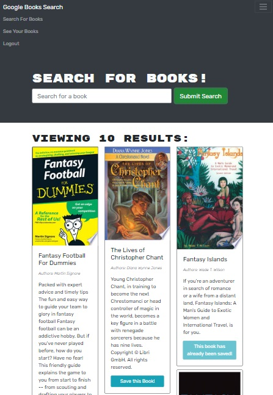
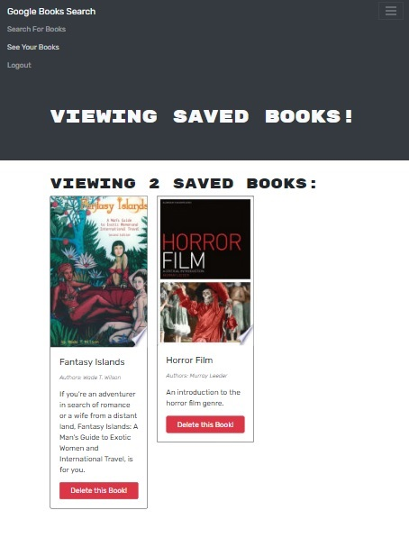

# Book Search Engine

This is a Google Books API search engine built with a RESTful API, and refactor it to be a GraphQL API built with Apollo Server. The app was built using the MERN stack, with a React front end, MongoDB database, and Node.js/Express.js server and API. You are able to create a profile to look up books and add them to a list of favorties.

## Table of Contents

- [Book Search Engine](#book-search-engine)
  - [Table of Contents](#table-of-contents)
  - [Technologies Used](#technologies-used)
  - [Screenshots](#screenshots)
  - [Installation](#installation)
  - [Questions?](#questions)


## Technologies Used

- MongoDB
- Express
- React
- Node.js
- GraphQL
- Heroku
- Mern Stack

## Screenshots


g

## Installation

```
npm install
npm run develop
```


## Questions?

If you have any questions about this projects, please contact me directly at [c.vazquez1986@gmail.com](mailto:c.vazquez1986@gmail.com).  
You can view more of my projects at [Clos86](https://github.com/Clos86).
